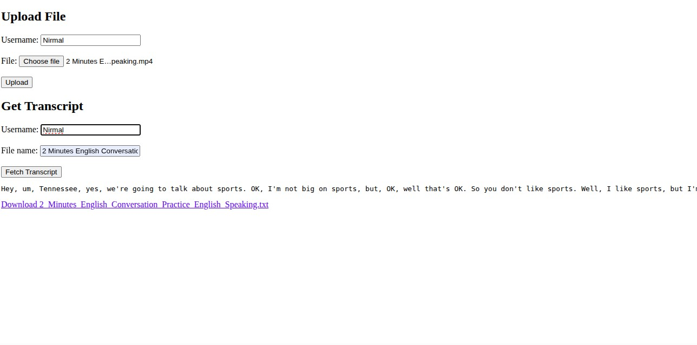

# AWS-Audio-Video-Transcription-ServiceAWS-Audio-Video-Transcription-Service
This project provides a complete AWS-based solution to upload MP3/MP4 files, automatically transcribe them to text using AWS Transcribe, and allow users to fetch/download their transcripts securely.

✨ Features
☑️ Upload audio/video files via a web interface.

☑️ Files are stored in S3 input bucket under user-specific folders.

☑️ Automatic transcription via AWS Transcribe.

☑️ Transcripts are saved as .txt files in the S3 output bucket.

☑️ Users can fetch or download their transcript.

🌐 Architecture

Frontend: HTML + JS form to upload files and fetch transcripts.

Backend: Node.js + Express + AWS SDK + Docker.

S3 Buckets: For input/output file storage.

AWS Transcribe: Handles conversion of audio/video to text.

